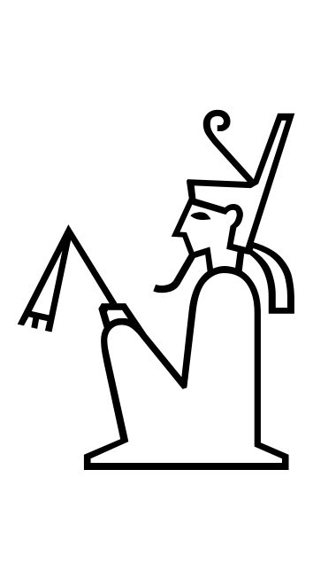

# archaeohack-starterpack

Above: King holding flail and wearing red crown of Lower Egypt; (Gardiner A46)

## Background
1. Found [spreadsheet](data/gardiner_hieroglyphs.csv) pairing unicode hieroglyphs to gardiner numbers, additional descriptive context
2. Wrote/ran a [script](lib/extract_literal_unicode.rb) to loop through hieroglyphs in the [spreadsheet](data/gardiner_hieroglyphs.csv) and extract a ASCII hex literal value for each unicode character (e.g., `𓀀` is `13000`); wrote updated results to [json file](data/gardiner_hieroglyphs_with_unicode_hex.json).
3. Wrote/ran a [script](lib/generate_pngs_from_unicode.rb) to loop through the [json file](data/gardiner_hieroglyphs_with_unicode_hex.json) and generate a PNG image file for each hieroglyph using [a compatible font](lib/font/NotoSansEgyptianHieroglyphs-Regular.ttf). Results are saved to a [folder](data/pngs) with each file named as the hieroglyph's `unicode_hex` value (e.g., [13000.png](data/pngs/13000.png))

## Questions
- Is this the full set of hieroglyphs? If not, is it an adequate set? 
- If not adequate, how might we get a fuller set of unicode -> gardiner numbers to rerun this process on? 
- Is the size adequate? (Can regenerate them larger, the process uses a scalable vector font.)